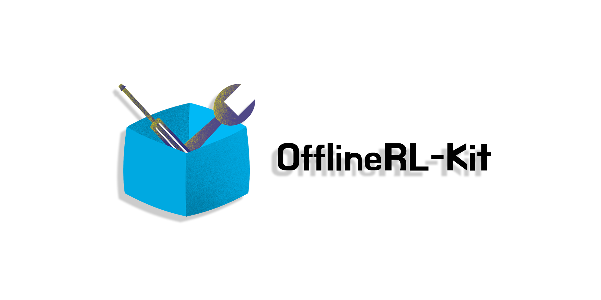

<div align="center">
  
</div>

---

# OfflineRL-Kit: An elegant PyTorch offline reinforcement learning library.


OfflineRL-Kit is an offline reinforcement learning library based on pure PyTorch. This library has some features which are friendly and convenient for researchers, including:

- Elegant framework, the code structure is very clear and easy to use
- State-of-the-art offline RL algorithms, including model-free and model-based approaches
- High scalability, you can build your new algorithm with few lines of code based on the components in our library
- Support parallel tuning, very convenient for researchers
- Clear and powerful log system, easy to manage experiments

## Supported algorithms
- Model-free
    - [Conservative Q-Learning (CQL)](https://arxiv.org/abs/2006.04779)
    - [TD3+BC](https://arxiv.org/abs/2106.06860)
    - [Implicit Q-Learning (IQL)](https://arxiv.org/abs/2110.06169)
    - [Ensemble-Diversified Actor Critic (EDAC)](https://arxiv.org/abs/2110.01548)
    - [Mildly Conservative Q-Learning (MCQ)](https://arxiv.org/abs/2206.04745)
- Model-based
    - [Model-based Offline Policy Optimization (MOPO)](https://arxiv.org/abs/2005.13239)
    - [Conservative Offline Model-Based Policy Optimization (COMBO)](https://arxiv.org/abs/2102.08363)
    - [Robust Adversarial Model-Based Offline Reinforcement Learning (RAMBO)](https://arxiv.org/abs/2204.12581)

## Installation
```shell
git clone https://github.com/yihaosun1124/OfflineRL-Kit.git
cd OfflineRL-Kit
python setup.py install
```

## Quick Start
### Train
This is an example of CQL. You can also run the full script at [run_example/run_cql.py](https://github.com/yihaosun1124/OfflineRL-Kit/blob/main/run_example/run_cql.py).

First, make an environment and get the offline dataset:

```python
env = gym.make(args.task)
dataset = qlearning_dataset(env)
buffer = ReplayBuffer(
    buffer_size=len(dataset["observations"]),
    obs_shape=args.obs_shape,
    obs_dtype=np.float32,
    action_dim=args.action_dim,
    action_dtype=np.float32,
    device=args.device
)
buffer.load_dataset(dataset)
```

Define the models and optimizers:

```python
actor_backbone = MLP(input_dim=np.prod(args.obs_shape), hidden_dims=args.hidden_dims)
critic1_backbone = MLP(input_dim=np.prod(args.obs_shape) + args.action_dim, hidden_dims=args.hidden_dims)
critic2_backbone = MLP(input_dim=np.prod(args.obs_shape) + args.action_dim, hidden_dims=args.hidden_dims)
dist = TanhDiagGaussian(
    latent_dim=getattr(actor_backbone, "output_dim"),
    output_dim=args.action_dim,
    unbounded=True,
    conditioned_sigma=True
)
actor = ActorProb(actor_backbone, dist, args.device)
critic1 = Critic(critic1_backbone, args.device)
critic2 = Critic(critic2_backbone, args.device)
actor_optim = torch.optim.Adam(actor.parameters(), lr=args.actor_lr)
critic1_optim = torch.optim.Adam(critic1.parameters(), lr=args.critic_lr)
critic2_optim = torch.optim.Adam(critic2.parameters(), lr=args.critic_lr)
```

Setup policy:

```python
policy = CQLPolicy(
    actor,
    critic1,
    critic2,
    actor_optim,
    critic1_optim,
    critic2_optim,
    action_space=env.action_space,
    tau=args.tau,
    gamma=args.gamma,
    alpha=alpha,
    cql_weight=args.cql_weight,
    temperature=args.temperature,
    max_q_backup=args.max_q_backup,
    deterministic_backup=args.deterministic_backup,
    with_lagrange=args.with_lagrange,
    lagrange_threshold=args.lagrange_threshold,
    cql_alpha_lr=args.cql_alpha_lr,
    num_repeart_actions=args.num_repeat_actions
)
```

Define logger:
```python
log_dirs = make_log_dirs(args.task, args.algo_name, args.seed, vars(args))
output_config = {
    "consoleout_backup": "stdout",
    "policy_training_progress": "csv",
    "tb": "tensorboard"
}
logger = Logger(log_dirs, output_config)
logger.log_hyperparameters(vars(args))
```

Load all components into the trainer and train it:
```python
policy_trainer = MFPolicyTrainer(
    policy=policy,
    eval_env=env,
    buffer=buffer,
    logger=logger,
    epoch=args.epoch,
    step_per_epoch=args.step_per_epoch,
    batch_size=args.batch_size,
    eval_episodes=args.eval_episodes
)

policy_trainer.train()
```

### Tune
You can easily tune your algorithm with the help of [Ray](https://github.com/ray-project/ray):
```python
ray.init()
# load default args
args = get_args()

config = {}
real_ratios = [0.05, 0.5]
seeds = list(range(2))
config["real_ratio"] = tune.grid_search(real_ratios)
config["seed"] = tune.grid_search(seeds)

analysis = tune.run(
    run_exp,
    name="tune_mopo",
    config=config,
    resources_per_trial={
        "gpu": 0.5
    }
)
```
You can see the full script at [tune_example/tune_mopo.py](https://github.com/yihaosun1124/OfflineRL-Kit/blob/main/tune_example/tune_mopo.py).

### Log
Our logger supports a variant of record file types, including .txt(backup for stdout), .csv(records loss or performance or other metrics in training progress), .tfevents (tensorboard for visualizing the training curve), .json(backup for hyper-parameters).
Our logger also has a clear log structure:
```
└─log(root dir)
    └─task
        └─algo_0
        |   └─seed_0&timestamp_xxx
        |   |   ├─checkpoint
        |   |   ├─model
        |   |   ├─record
        |   |   │  ├─tb
        |   |   │  ├─consoleout_backup.txt
        |   |   │  ├─policy_training_progress.csv
        |   |   │  ├─hyper_param.json
        |   |   ├─result
        |   └─seed_1&timestamp_xxx
        └─algo_1
```
This is an example of logger and you can see the full script at [offlinerlkit/policy_trainer/mb_policy_trainer.py](https://github.com/yihaosun1124/OfflineRL-Kit/blob/main/offlinerlkit/policy_trainer/mb_policy_trainer.py).

First, import some relevant packages:
```python
from offlinerlkit.utils.logger import Logger, make_log_dirs
```
Then initialize logger:
```py
log_dirs = make_log_dirs(args.task, args.algo_name, args.seed, vars(args))
# key: output file name, value: output handler type
output_config = {
    "consoleout_backup": "stdout",
    "policy_training_progress": "csv",
    "dynamics_training_progress": "csv",
    "tb": "tensorboard"
}
logger = Logger(log_dirs, output_config)
logger.log_hyperparameters(vars(args))
```

Let's log some metrics:
```python
# log
logger.logkv("eval/normalized_episode_reward", norm_ep_rew_mean)
logger.logkv("eval/normalized_episode_reward_std", norm_ep_rew_std)
logger.logkv("eval/episode_length", ep_length_mean)
logger.logkv("eval/episode_length_std", ep_length_std)
# set timestep
logger.set_timestep(num_timesteps)
# dump results to the record files
logger.dumpkvs()
```

### Plot
```shell
python run_example/plotter.py --algos "mopo" "cql" --task "hopper-medium-replay-v2"
```

## Benchmark Results
Benchmark results are available soon.


